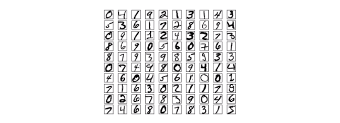

# Basic Knowledge

## TensorFlow Frame

### What is TensorFlow？

#### 基本简介

- TensorFlow 是 Google 基于 DistBelief 进行研发的第二代人工智能学习系统
- 可被用于语音识别或图像识别等多项机器学习和深度学习领域
- TensorFlow 是将复杂的数据结构传输至人工智能神经网中进行分析和处理过程的系统
- TensorFlow 支持 CNN、RNN 和 LSTM 算法，这都是目前在 Image、Speech 和 NLP 最流行的深度神经网路模型

#### 更多简介

- 【[更多关于TensorFlow的简介](https://github.com/99cloud/lab-algorithm/tree/master/DeepLearning/Tensorflow#121-%E7%AE%80%E4%BB%8B)】
- 【[TensorFlow 的特征](https://github.com/99cloud/lab-algorithm/tree/master/DeepLearning/Tensorflow#123-tensorflow-%E7%9A%84%E7%89%B9%E5%BE%81)】

### TensorFlow 安装与环境配置

#### 基础安装步骤

- 安装 Python 环境，此处建议安装 [Anaconda](https://www.anaconda.com/) 的 Python 3.7 版本（后文均以此为准），这是一个开源的 Python 发行版本，提供了一个完整的科学计算环境，包括 NumPy、SciPy 等常用科学计算库，当然，你有权选择自己喜欢的 Python 环境，Anaconda 的安装包可在 [这里](https://mirrors.tuna.tsinghua.edu.cn/anaconda/archive/) 获得
- 使用 Anaconda 自带的 conda 包管理器建立一个 Conda 虚拟环境，并进入该虚拟环境，在命令行下输入

    ```bash
    conda create --name tf2.0 python=3.7   # “tf2.0”是你建立的 Conda 虚拟环境的名字
    conda activate tf2.0                   # 进入名为“tf2.0”的虚拟环境
    ```

- 使用 Python 包管理器 pip 安装 TensorFlow，在命令行下输入

    ```bash
    pip install tensorflow==2.0.0           # TensorFlow CPU 版本
    ```

    或者

    ```bash
    pip install tensorflow-gpu==2.0.0       # TensorFlow GPU 版本，需要具有NVIDIA显卡及正确安装驱动程序，因为目前没有 GPU，不做进一步探究
    ```

#### 更多配置信息

- 【[更多安装详情](https://github.com/99cloud/lab-algorithm/tree/master/DeepLearning/Tensorflow#13-tensorflow-%E5%AE%89%E8%A3%85%E4%B8%8E%E7%8E%AF%E5%A2%83%E9%85%8D%E7%BD%AE)】
- 【[使用 Docker 部署 TensorFlow 环境](https://github.com/99cloud/lab-algorithm/tree/master/DeepLearning/Tensorflow#132-%E4%BD%BF%E7%94%A8-docker-%E9%83%A8%E7%BD%B2-tensorflow-%E7%8E%AF%E5%A2%83)】

#### 安装测试

安装完毕后，我们来编写一个简单的程序来验证安装

在命令行下输入 `conda activate tf2.0` 进入之前建立的安装有 TensorFlow 的 Conda 虚拟环境，再输入 `python` 进入 `Python 环境，逐行输入以下代码

```python
import tensorflow as tf

A = tf.constant([[1, 2], [3, 4]])
B = tf.constant([[5, 6], [7, 8]])
C = tf.matmul(A, B)

print(C)
```

如果能够最终输出

```console
tf.Tensor(
[[19 22]
[43 50]], shape=(2, 2), dtype=int32)
```

说明 TensorFlow 已安装成功，运行途中可能会输出一些 TensorFlow 的提示信息，属于正常现象

### TensorFlow 使用

- 基本使用，详见【[Tensorflow 基础](https://github.com/99cloud/lab-algorithm/tree/master/DeepLearning/Tensorflow#14-tensorflow-%E5%9F%BA%E7%A1%80)】
- 求导机制，详见【[自动求导机制](https://github.com/99cloud/lab-algorithm/tree/master/DeepLearning/Tensorflow#15-%E8%87%AA%E5%8A%A8%E6%B1%82%E5%AF%BC%E6%9C%BA%E5%88%B6)】

## MNIST Dataset

### What is MNIST？

- 由 Google 和纽约大学克朗研究所共同建立的手写数字的数据库
- 共有 70000 张训练图像（包括 60000 张训练图像和 10000 张测试图像）
- 所有图像均是 0~9 的手写数字，示例如图所示



## Flask Flame and Concordance

### What is Flask?

- 是一个轻量级的 web 应用框架
- 使用 python 语言进行编写

### 训练 MNIST 数据集

- 下载数据集
- 编写训练程序
- 训练模型
- 验证训练模型

### 使用 Flask 调用模型

- 使用训练好的模型
- 定义参数
- 通过端进行传参
- 进行数据验证并返回

### 整合步骤

- 训练并生成模型
- 暴露接口
- 前端调用
- 验证并返回结果